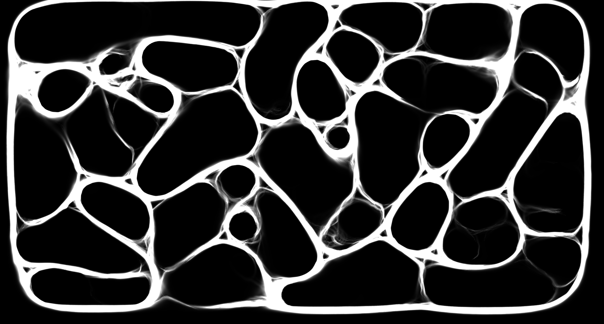

# Slime Mold GPU Simulation

A **GPU-accelerated slime simulation** in Python, inspired by Seb Lague's slime approach and based on agent-based modeling plus a compute-shader pipeline. This project can generate beautiful, cell-like or net-like patterns reminiscent of Physarum polycephalum or other emergent transport networks.

## Table of Contents
1. [slime_sim_gpu.py and config.py](#slime_sim_gpu-and-configpy)
2. [Screenshots](#screenshots)
3. [Project Structure](#project-structure)
4. [Installation & Requirements](#installation--requirements)
5. [Usage](#usage)
6. [Configuration Presets (config.py)](#configuration-presets-configpy)
7. [How It Works](#how-it-works)
8. [Troubleshooting & Tips](#troubleshooting--tips)
9. [License](#license)
10. [References](#references)

---

## Screenshots
Below are example outputs corresponding to some of the presets. (You can place your own images in an `images/` folder and reference them here.)

### "Racers" Fast moving - small groups Pattern (Preset #1)


### White Net (Preset #2)


### Green Lumps (Preset #3)


### "The Matrix" small lines without much turning (Preset #4)


> For more examples, see the additional presets (#5–#10) or experiment with your own configurations.

---

## slime_sim_gpu.py and config.py

- **`slime_sim_gpu.py`**:  
  The Python script that sets up **PyOpenGL**, loads and compiles the **compute shaders**, performs the **rendering**, and manages the main simulation loop.

- **`config.py`**:  
  This file contains **10 different presets** under a single dictionary, `ALL_PRESETS`. You select which preset to use by setting the variable `CURRENT_PRESET` at the top (1 through 10). Each preset configures simulation parameters (agent speeds, deposit amounts, blur radius, color modes, etc.).

---

## Project Structure

A suggested folder layout might look like this:

```plaintext
slime_gpu_project/
├─ README.md               # This file
├─ slime_sim_gpu.py       # Main simulation script
├─ config.py              # Holds all presets and configuration logic
├─ images/                # (optional) folder for screenshots
│   ├─ preset1_example.png
│   └─ ...
└─ obstacles.png          # (optional) if you want obstacles
```

## Installation & Requirements

- Python 3.9+ recommended (older versions may still work, but untested)
- A GPU with OpenGL 4.3 or higher support (check your graphics drivers)
- Python libraries (install via pip):
  ```bash
  pip install glfw PyOpenGL pillow numpy
  ```
- (Optional) An obstacle image of size SIM_WIDTH x SIM_HEIGHT, if you enable USE_OBSTACLES in config.py

## Usage

1. Pick a Preset: In config.py, set:
   ```python
   CURRENT_PRESET = 1  # or 2..10
   ```
   Each preset yields a unique style.

2. Run the main script:
   ```bash
   python slime_sim_gpu.py
   ```
   A window appears, showing the slime simulation in real-time.

3. Screenshot: Press the key defined by SCREENSHOT_KEY (usually 'F') to save a PNG of the current frame.

4. Close: Use the window's close button or press Ctrl-C in your terminal.

## Configuration Presets (config.py)

Inside config.py, you'll see a dictionary called `ALL_PRESETS`, which holds 10 separate configurations. At the top of config.py, the line `CURRENT_PRESET = X` determines which block of settings is active.

Each preset defines parameters like:

- WINDOW_WIDTH / WINDOW_HEIGHT: The size of the output window
- SIM_WIDTH / SIM_HEIGHT: The internal resolution for the trail map
- NUM_AGENTS: How many slime agents to create
- AGENT_SPEED / TURN_SPEED: Movement speed and turning rate
- SENSOR_ANGLE_DEG / SENSOR_DISTANCE: How far and wide each agent senses the trail
- DEPOSIT_AMOUNT: The baseline deposit an agent makes per frame
- AGENT_DEPOSIT_SCALE: A factor that scales deposit inversely with the total agent count
- RANDOM_TURN_FACTOR: How much random "wiggle" is added to each agent's direction
- EVAPORATION_FACTOR: Controls how quickly the trail fades each frame
- BLUR_RADIUS / BLUR_PASSES: The radius and number of blur passes for diffusing the trail
- COLOR_MODE: "SUM" for grayscale, "RGB" for multi-species color mapping, or "CUSTOM"
- COLOR_MULTIPLIER: Scales the brightness of the final rendered output
- BACKGROUND_COLOR: The clear color behind the slime texture
- TARGET_FPS: Limits the update loop to a certain frames-per-second
- SCREENSHOT_KEY / SCREENSHOT_FILE: The hotkey and filename for saving screenshots

### Brief Overview of the 10 Presets

1. Cell-Like Bubble – Slower speeds, bigger blur, thick bubble walls
2. Blue Net – Medium speed, bright "custom" color for a neon-blue net
3. Green Lumps – Different random wiggle, forming lumps
4. Wrinkled Lines – Wavy line patterns with moderate fade
5. Sparse Minimal Lines – Fewer agents, faint deposit lines
6. Dense Liquid Web – High deposit + more dynamic net
7. Two-Species Rainbow – R/G channels for multiple species
8. Two-Species Complementary – Another multi-species variation, more blur
9. Obstacle Maze – Load a labyrinth-like image to see how slime flows around walls
10. Fast Flicker – Quick fade, no blur, ephemeral lines appear/disappear rapidly

## How It Works

- Agent-Based: Each slime agent senses the local trail in three directions (front-left, front, front-right), turning toward the direction with the strongest trail
- Deposits: Agents deposit a small value into a GPU texture each frame (imageStore)
- Evaporation & Blur: Another compute pass multiplies the texture by EVAPORATION_FACTOR, then optionally applies a blur to create "cell walls" or "web" patterns
- Multi-Species: Up to 4 species can store trails in RGBA channels. Each species might have its own speed, turn speed, deposit, etc.
- Rendering: A simple vertex+fragment shader draws a full-screen quad, sampling the trail. The color mode ("SUM", "RGB", or "CUSTOM") determines how channels are combined on screen

## Troubleshooting & Tips

- All White or Overly Bright: Lower DEPOSIT_AMOUNT or COLOR_MULTIPLIER. Also consider reducing BLUR_RADIUS
- Single Agent = Giant Blob: We use AGENT_DEPOSIT_SCALE to scale deposit inversely with total agent count. Adjust if needed
- Performance: Large SIM_WIDTH x SIM_HEIGHT plus high agent counts can be demanding. If you experience slowdowns, reduce the resolution or the number of agents
- Obstacles: Ensure obstacles.png matches (SIM_WIDTH x SIM_HEIGHT). White = free, black = blocked
- Colors:
    - "SUM": sums the RGBA channels and renders them as grayscale
    - "RGB": treats R/G/B channels as color
    - "CUSTOM": you can modify the fragment shader for specialized coloration

---
## References

- Seb Lague: Inspiration from his "Slime Simulation" series (Unity-based)
- Paper: Jones, J. (2010). Characteristics of Pattern Formation and Evolution in Approximations of Physarum Transport Networks
- PyOpenGL Docs: https://pyopengl.sourceforge.net/
- OpenGL Compute Shaders: Introduced in OpenGL 4.3, official specification

Enjoy creating mesmerizing slime patterns! Modify or create new presets in config.py to discover endless emergent designs.

---
## License

MIT License

Copyright (c) [2025] [Jasper G]

Permission is hereby granted, free of charge, to any person obtaining a copy
of this software and associated documentation files (the "Software"), to deal
in the Software without restriction, including without limitation the rights
to use, copy, modify, merge, publish, distribute, sublicense, and/or sell
copies of the Software, and to permit persons to whom the Software is
furnished to do so, subject to the following conditions:

The above copyright notice and this permission notice shall be included in all
copies or substantial portions of the Software.

THE SOFTWARE IS PROVIDED "AS IS", WITHOUT WARRANTY OF ANY KIND, EXPRESS OR
IMPLIED, INCLUDING BUT NOT LIMITED TO THE WARRANTIES OF MERCHANTABILITY,
FITNESS FOR A PARTICULAR PURPOSE AND NONINFRINGEMENT. IN NO EVENT SHALL THE
AUTHORS OR COPYRIGHT HOLDERS BE LIABLE FOR ANY CLAIM, DAMAGES OR OTHER
LIABILITY, WHETHER IN AN ACTION OF CONTRACT, TORT OR OTHERWISE, ARISING FROM,
OUT OF OR IN CONNECTION WITH THE SOFTWARE OR THE USE OR OTHER DEALINGS IN THE
SOFTWARE.
